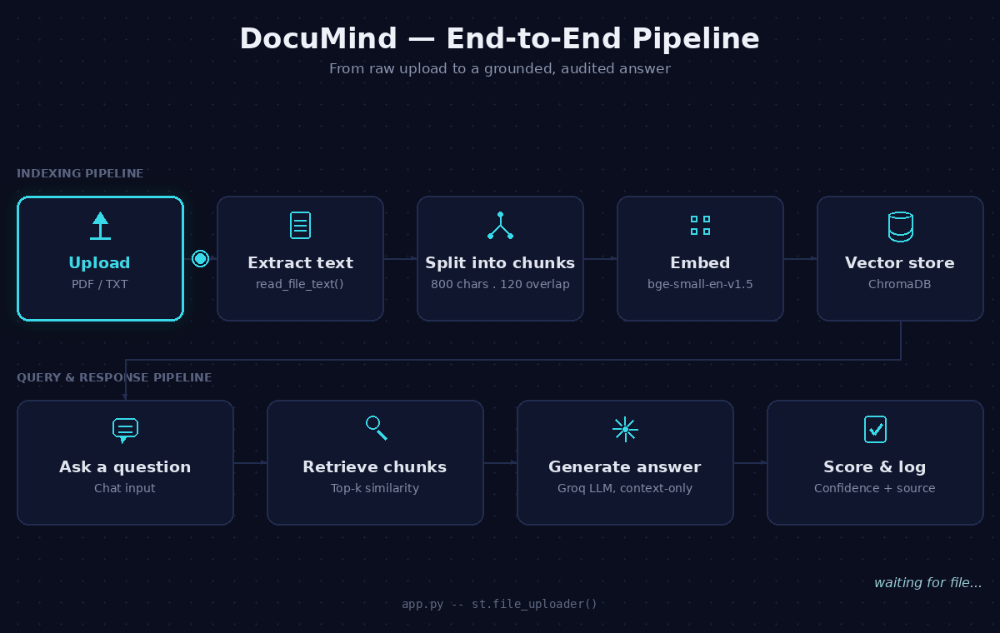
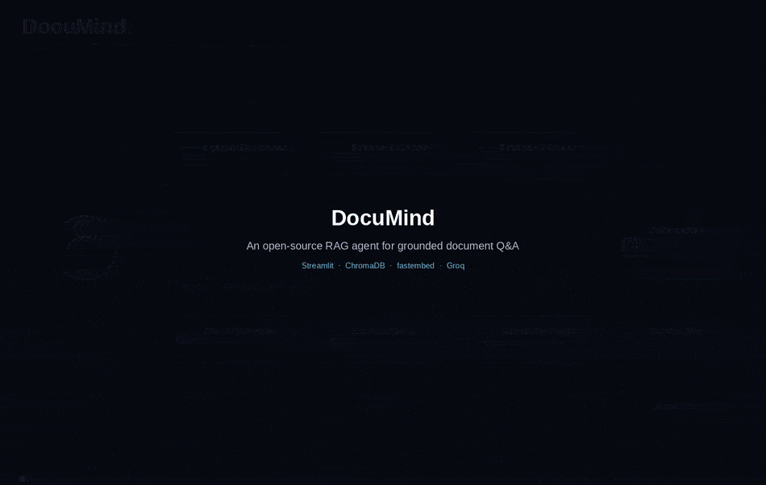

<a id="top"></a>

<a id="about-the-creator"></a>
<div align="center">


<br/>


<br/>


<br/>

### **Thanojan Sivasuntharam**


🎓 Final-year BSc (Hons) Computer Science with Artificial Intelligence
<br/>
🏫 NIBM Sri Lanka · Coventry University (UK) Affiliate
<br/>
📍 Based in Jaffna, Sri Lanka

<br/>

[](mailto:officialthanox@gmail.com)
[](https://linkedin.com/in/nevin-thanox)
[](https://github.com/officialthanox/Documind)

[](mailto:officialthanox@gmail.com)

</div>

<br/>

I build AI systems designed to be **trusted**, not just demoed. Every project I ship is source-traceable, every confidence score is computed math instead of model guesswork, and every failure mode is handled **on purpose, not by accident.**

> 📝 **Short version, if you're skimming:** the project below — **DocuMind** — was designed and built **end-to-end, solo**: retrieval pipeline, grounding logic, audit trail, and container deployment. **Read it as the interview.**

<div align="right"><a href="#top">⬆️ back to top</a></div>


<div align="center">

### 🚀 FEATURED PROJECT


<br/>

[](#-tech-stack)
[](#-tech-stack)
[](#-tech-stack)
[](#-tech-stack)
[](#-tech-stack)

[](#)
[](#about-the-creator)

[](https://github.com/officialthanox/Documind/stargazers)
[](https://github.com/officialthanox/Documind/network/members)
[](https://github.com/officialthanox/Documind/commits/main)

### **[▶️ Watch the Full Demo on YouTube](https://youtu.be/kKCgGaGkbi4)**

</div>

<br/>

> 💡 *"An AI system's real value isn't in how confidently it answers — it's in how honestly it admits what it doesn't know."*
> **— Engineering principle behind DocuMind's grounding strategy**


<a id="toc"></a>
## 📑 Table of Contents

| | |
|---|---|
| 👋 [About the Creator](#about-the-creator) | 🏗️ [Architecture](#architecture) |
| ⚡ [At a Glance](#at-a-glance) | ⚙️ [Engineering Decisions](#engineering-decisions) |
| 📁 [Repository Structure](#repo-structure) | 🛠️ [Skills & Competencies](#skills) |
| 🧠 [Overview](#overview) | 🧰 [Tech Stack](#tech-stack) |
| 💼 [Business Value & Impact](#business-value) | 🚀 [Getting Started](#getting-started) |
| 🎬 [See It In Action](#see-it-in-action) | 📈 [Scaling to Production](#scaling) |
| 🧩 [The Problem It Solves](#the-problem) | 📬 [Contact](#contact) |


<a id="at-a-glance"></a>
## ⚡ At a Glance

- 🎯 **Retrieval-grounded, not model-guessed.** Every answer comes exclusively from the uploaded document; the LLM is contractually instructed to refuse rather than fabricate.
- 📊 **Confidence you can audit.** The trust score is computed from vector-distance math (`1 − avg(distance)`) — deterministic and explainable, not something the model can fake.
- 🔗 **Every claim is traceable.** Each answer names its source file, and every exchange is logged for review.
- 🪶 **Small on purpose.** The entire pipeline runs in **209 lines of Python across 5 single-responsibility modules** — no framework bloat, no hidden magic.
- 🐳 **One command to run it.** `docker compose up` — secrets live in environment variables, never in code.

<div align="right"><a href="#top">⬆️ back to top</a></div>

<a id="repo-structure"></a>
## 📁 Repository Structure

<details open>
<summary><b>Click to expand / collapse the folder tree</b> 🗂️</summary>

```
Documind/
├── .streamlit/
│   └── config.toml                 # UI theme (colors, font)
├── backend/
│   ├── __init__.py
│   ├── config.py                   # env vars, cached resources (embedder, vector DB, LLM client)
│   ├── rag.py                      # ingest → chunk → embed → retrieve
│   ├── llm.py                      # prompt construction + grounded generation
│   └── audit.py                    # Q&A history: save / list / clear
├── frontend/
│   └── app.py                      # Streamlit chat UI (upload, chat, avatars, metrics)
├── Demo/
│   ├── 01_end_to_end_pipeline.gif
│   └── documind_architecture_showcase.gif
├── data/                           # runtime-only: chroma index, uploads, audit log (git-ignored)
├── .env.example
├── .gitignore
├── docker-compose.yml
├── Dockerfile
├── requirements.txt
└── README.md
```

</details>

<div align="right"><a href="#top">⬆️ back to top</a></div>

<a id="overview"></a>
## 🧠 Overview

DocuMind is a **Retrieval-Augmented Generation (RAG) agent**: a document is ingested, split into overlapping chunks, embedded into vectors, and indexed locally. When a user asks a question, the system retrieves the most relevant chunks, bounds them into a context window, and hands *only* that context to an LLM for generation. Every answer carries a **computed confidence score**, a **named source**, and a **permanent audit entry**.

<div align="center">

**Five modules. One job each. No monolith. 🧩**

</div>

<div align="right"><a href="#top">⬆️ back to top</a></div>

<a id="business-value"></a>
## 💼 Business Value & Impact

*This isn't a feature list — it's a map from architectural choices to business outcomes.*

### 📊 Impact

| Outcome | How It's Delivered |
|---|---|
| ⚡ Faster Answers | Direct, source-cited responses replace manual document skimming |
| 🛡️ Fewer Failures | Architectural constraints curb confident-wrong answers and silent overreach |
| ✅ Verifiable Trust | Every answer is source-attributed with a permanent audit trail |
| 💰 Lower Compute Cost | One-time initialization of the embedder, vector store, and LLM client cuts repeated overhead |
| 🔁 Consistent Runs | Containerized configuration runs identically across environments, with zero secret exposure |

### 💎 Business Value

| Dimension | Value Delivered |
|---|---|
| ⏱️ Time Savings | One-time setup, then source-grounded answers replace manual document review |
| 🎯 Error Reduction | Prompt-contract grounding stops fabricated answers at the architecture level |
| 📋 Risk & Compliance | Source-attributed, permanently logged answers give a reviewable audit trail |
| 🐳 Deployment Cost | Docker packaging runs identically across dev, staging, and production |
| 🔧 Operational Continuity | Failures surface clearly; a missing API key hard-stops with an explicit error |

> 🏛️ Trust here is architectural, not cosmetic. Confidence math, prompt contracts, retrieval routing, and audit logs are what separate a defensible AI feature from a lucky demo.

<div align="right"><a href="#top">⬆️ back to top</a></div>

<a id="see-it-in-action"></a>
## 🎬 See It In Action

<div align="center">

<table>
<tr>
<td align="center" width="50%"><b>🔄 End-to-End Pipeline</b><br/></td>
<td align="center" width="50%"><b>🏗️ Architecture Showcase</b><br/></td>
</tr>
</table>

### **[▶️ Watch the Full Walkthrough on YouTube](https://youtu.be/kKCgGaGkbi4)**

</div>

<div align="right"><a href="#top">⬆️ back to top</a></div>

<a id="the-problem"></a>
## 🧩 The Problem It Solves

| ❌ Without This Workflow | ✅ With DocuMind |
|---|---|
| Manually skim a PDF/TXT to find an answer | Ask in plain English, get a direct answer |
| No way to verify an AI's claim against the source document | Every answer cites the exact source file it was pulled from |
| Generic LLM answers can drift from — or invent beyond — the document | The prompt contract restricts generation to retrieved context only, and says so when context is insufficient |
| No sense of how "sure" an answer is | A numeric confidence score, derived from vector-similarity distance, accompanies every answer |
| No record of what was asked or answered | Every Q&A pair is persisted to an audit log, reviewable or clearable on demand |

<div align="right"><a href="#top">⬆️ back to top</a></div>

<a id="architecture"></a>
## 🏗️ Architecture

**Pipeline flow:**

```
📥  Upload (PDF/TXT)
      │
      ▼
✂️  Text Extraction (pypdf for PDFs)
      │
      ▼
🧩  Chunking (800 chars, 120-char overlap)
      │
      ▼
🧬  Embedding (fastembed · BAAI/bge-small-en-v1.5)
      │
      ▼
🗄️  Vector Store (ChromaDB, persistent local collection)
      │
      ▼
🔍  Query → Embed → Similarity Search (top-6) → Confidence Score
      │
      ▼
🧠  Context Assembly → Groq LLM (openai/gpt-oss-120b)
      │
      ▼
✅  Grounded Answer + Source + Confidence → Audit Log (JSON)
```

<div align="right"><a href="#top">⬆️ back to top</a></div>

<a id="engineering-decisions"></a>
## ⚙️ Engineering Decisions

*Every decision below trades a feature for a guarantee — that trade is the point.*

- 🎯 **Single active-document indexing.** Uploading a new file clears prior vectors before re-indexing. This deliberately scopes retrieval to one document at a time, trading multi-document convenience for zero cross-document bleed-through.
- 🧮 **Computed, not claimed, confidence.** The confidence score comes from vector-query distance (`1 − avg(distance)`) — a deterministic, explainable trust signal instead of asking the LLM to self-rate its own certainty.
- 🛡️ **Guardrail-routed retrieval.** Aggregate-style questions ("how many," "compare," "list all") bypass top-k similarity search entirely and pull the full indexed context, because counting or comparing across a document needs everything — not just the closest match.
- 📜 **Prompt-contract grounding.** The LLM is explicitly instructed to answer using *only* the supplied context, and to say so when the answer isn't present — a direct, low-overhead guardrail against fabrication.
- 🩹 **Graceful degradation.** LLM/API failures are caught and surfaced as a clear, user-facing message instead of crashing the session.
- 🔐 **Secrets never touch source.** The API key is read exclusively from the environment; the app hard-stops with an explicit error if it's missing, rather than failing silently downstream.
- ♻️ **Disposable runtime state.** The vector index, uploaded files, and audit log all live under `data/` and are excluded from version control — regenerable session state, not source of truth.
- ⚡ **Resource caching by design.** The embedding model, vector collection, and LLM client are wrapped in `@st.cache_resource`, initializing once instead of on every rerun.

<div align="right"><a href="#top">⬆️ back to top</a></div>

<a id="skills"></a>
## 🛠️ Skills and Competencies Demonstrated

**🤖 AI/ML Engineering**
- Retrieval-Augmented Generation (RAG) pipeline design, end-to-end
- Text chunking strategy with overlap tuning for retrieval quality
- Vector similarity search and distance-based confidence scoring
- Prompt engineering with explicit grounding constraints to reduce hallucination
- Retrieval routing (guardrail logic for aggregate-style queries)

**🔌 LLM & APIs**
- Groq API integration (`openai/gpt-oss-120b`)
- Prompt-contract design for grounded, hallucination-resistant generation

**🏗️ Backend Engineering**
- Modular, single-responsibility architecture (5 focused modules, zero monolith)
- Environment-driven configuration and secrets management
- Defensive error handling around third-party API calls

**🗄️ Data & Storage**
- ChromaDB (persistent local vector store)
- pypdf (PDF text extraction)
- JSON-based audit trail persistence

**🎨 Frontend / Product**
- Real-time chat UI built in Streamlit (session state, avatars, live toasts)
- UX-conscious feedback design (contextual first-run message, confidence badges, progressive disclosure)

**🚢 DevOps / Delivery**
- Containerization with Docker and Docker Compose (volume-mounted persistent data)
- Reproducible, dependency-pinned environments (`requirements.txt`)
- Clean separation of runtime artifacts from source control via `.gitignore`

> 🧭 **Methodology:** DocuMind is built on one constraint — *constrain the model before you trust it.* Every architectural choice — chunk size, retrieval routing, prompt contract, confidence computation — exists to narrow the system's behavior into something predictable, auditable, and explainable. That's the difference between a demo that feels smart and a system a business can rely on: engineering guardrails, not model size, are what make an AI feature trustworthy in production.

<div align="right"><a href="#top">⬆️ back to top</a></div>

<a id="tech-stack"></a>
## 🧰 Tech Stack

| Layer | Tool | Role |
|---|---|---|
| 🎨 Frontend / UI | Streamlit | Chat interface, file upload, session state, live feedback |
| 🐍 Application Runtime | Python 3.11 | Core orchestration logic across all modules |
| 🧬 Embedding Model | fastembed (`BAAI/bge-small-en-v1.5`) | Converts text chunks and queries into vectors |
| 🗄️ Vector Store | ChromaDB (persistent client) | Stores and queries document embeddings locally |
| 🧠 LLM Inference | Groq API (`openai/gpt-oss-120b`) | Generates grounded answers from retrieved context |
| 📄 Document Parsing | pypdf | Extracts text from uploaded PDFs |
| ⚙️ Configuration | python-dotenv | Loads environment variables from `.env` |
| 🐳 Containerization | Docker · Docker Compose | Reproducible build and runtime, with volume-mounted data |
| 📋 Observability | Custom JSON audit log | Persists every question, answer, source, and confidence score |

<div align="right"><a href="#top">⬆️ back to top</a></div>

<a id="getting-started"></a>
## 🚀 Getting Started

### 📥 1. Import the Project
```cmd
git clone <your-repo-url>
cd Documind
```

### 🔑 2. Configure Credentials

| Variable | Required | Where to Get It | Notes |
|---|---|---|---|
| `GROQ_API_KEY` | ✅ Yes | https://console.groq.com/keys | Free tier available, no card required |
| `DATA_DIR` | ⬜ No | — | Defaults to `./data` if unset |

### 🧾 3. Set Environment Variables
```env
GROQ_API_KEY=your_groq_api_key_here
DATA_DIR=./data
```

### 🧪 4. Smoke Test

**Option A — Docker 🐳:**
```cmd
docker compose up --build
```

**Option B — Local Python 🐍:**
```cmd
python -m venv venv
venv\Scripts\activate
pip install -r requirements.txt
streamlit run frontend/app.py
```

Then open **http://localhost:8501** — upload a PDF or TXT file and ask it a question.

> ✅ **A successful smoke test:** file indexed → toast confirmation → a chat answer with a visible confidence badge and source citation.

<div align="right"><a href="#top">⬆️ back to top</a></div>

<a id="scaling"></a>
## 📈 Scaling to Production

| Aspect | 🧪 Proof of Concept (Current) | 🏭 Production Plan |
|---|---|---|
| Audit Log | Flat JSON file | Managed relational database with indexed, queryable history |
| Document Scope | One active document at a time (re-indexed on upload) | Multi-document, multi-tenant collections with namespacing |
| Authentication | None | Native `st.login` / SSO integration |
| Secrets | `.env` file | Managed secrets store (cloud provider secrets manager) |
| Deployment | Single container via Docker Compose | Orchestrated deployment (e.g., Kubernetes) with autoscaling behind a load balancer |
| Observability | Console logging + JSON audit trail | Structured logging with metrics and distributed tracing |
| Vector Store | Local persistent ChromaDB | Managed or distributed vector database |

<div align="right"><a href="#top">⬆️ back to top</a></div>

<a id="contact"></a>
## 📬 Contact

<div align="center">

**Let's connect — always happy to talk AI, RAG systems, or internship opportunities.**

[](mailto:officialthanox@gmail.com)
[](https://linkedin.com/in/nevin-thanox)
[](https://github.com/officialthanox/Documind)

⭐ **If DocuMind was useful or interesting, consider starring the repo — it genuinely helps.**

*Trust here is architectural, not cosmetic.*

</div>


